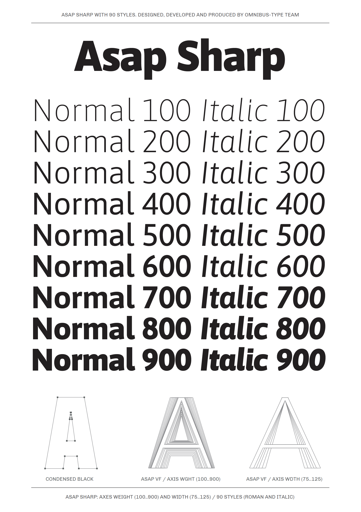

# Asap Sharp family (WIP)

**Omnibus-Type**  
*SIL Open Font License, 1.1*

Asap Sharp is the non-rounded version of the Asap family. It features a uniform stroke and clean, sharp corners for a more technical, geometric feel. Like the original, it offers standardized character widths across all styles, allowing you to change weights on-the-go without reflowing the text. Designed by Pablo Cosgaya and developed by the Omnibus-Type team, it is optimized for both screen and desktop use.

####Asap Sharp family contains:

* Condensed Thin/Condensed Thin Italic
* Condensed ExtraLight/Condensed Extralight Italic
* Condensed Light/Condensed Light Italic
* Condensed Regular/Condensed Italic
* Condensed Medium/Condensed Medium Italic
* Condensed SemiBold/Condensed SemiBold Italic
* Condensed Bold/Condensed Bold Italic
* Condensed ExtraBold/Condensed ExtraBold Italic
* Condensed Black/Condensed Black Italic

* SemiCondensed Thin/SemiCondensed Thin Italic
* SemiCondensed ExtraLight/SemiCondensed Extralight Italic
* SemiCondensed Light/SemiCondensed Light Italic
* SemiCondensed Regular/SemiCondensed Italic
* SemiCondensed Medium/SemiCondensed Medium Italic
* SemiCondensed SemiBold/SemiCondensed SemiBold Italic
* SemiCondensed Bold/SemiCondensed Bold Italic
* SemiCondensed ExtraBold/SemiCondensed ExtraBold Italic
* SemiCondensed Black/SemiCondensed Black Italic

* Thin/Thin Italic
* ExtraLight/Extralight Italic
* Light/Light Italic
* Regular/Italic
* Medium/Medium Italic
* SemiBold/SemiBold Italic
* Bold/Bold Italic
* ExtraBold/ExtraBold Italic
* Black/Black Italic

* SemiExpanded Thin/SemiExpanded Thin Italic
* SemiExpanded ExtraLight/SemiExpanded Extralight Italic
* SemiExpanded Light/SemiExpanded Light Italic
* SemiExpanded Regular/SemiExpanded Italic
* SemiExpanded Medium/SemiExpanded Medium Italic
* SemiExpanded SemiBold/SemiExpanded SemiBold Italic
* SemiExpanded Bold/SemiExpanded Bold Italic
* SemiExpanded ExtraBold/SemiExpanded ExtraBold Italic
* SemiExpanded Black/SemiExpanded Black Italic

* Expanded Thin/Expanded Thin Italic
* Expanded ExtraLight/Expanded Extralight Italic
* Expanded Light/Expanded Light Italic
* Expanded Regular/Expanded Italic
* Expanded Medium/Expanded Medium Italic
* Expanded SemiBold/Expanded SemiBold Italic
* Expanded Bold/Expanded Bold Italic
* Expanded ExtraBold/Expanded ExtraBold Italic
* Expanded Black/Expanded Black Italic

To contribute to the project contact [Omnibus-Type](http://omnibus-type.com/).

### Designer

* Pablo Cosgaya

### License

Copyright 2026 Omnibus-Type (www.omnibus-type.com | omnibus.type@gmail.com)

Licensed under the [*SIL Open Font License, 1.1*](http://scripts.sil.org/OFL); you may not use this file except in compliance with the License.

======
## FONTLOG for the Asap fonts

This file provides detailed information on the Asap font software.  
This information should be distributed along with the Asap fonts and any derivative works.

*To contribute to the project contact Omnibus-Type at omnibus.type@gmail.com*

======
## FONTLOG for the Asap Sharp fonts

This file provides detailed information on the Asap Sharp font software.  
This information should be distributed along with the Asap fonts and any derivative works.

**7 May 2026 (v.1.001) Omnibus-Type** 
- Initial release

### Acknowledgements

If you make modifications be sure to add your name (N), email (E), web-address
(if you have one) (W) and description (D). This list is in alphabetical order.

**N:** **Pablo Cosgaya**  
**E:** omnibus.type@gmail.com  
**W:** http://www.omnibus-type.com  
**D:** Designer of Asap Sharp

**N:** **Oscar Guerrero**  
**E:** omnibus.type@gmail.com  
**W:** http://www.omnibus-type.com  
**D:** Typeface development

**N:** **Héctor Gatti**  
**E:** omnibus.type@gmail.com  
**W:** http://www.omnibus-type.com  
**D:** Designer of Ancha upstream
